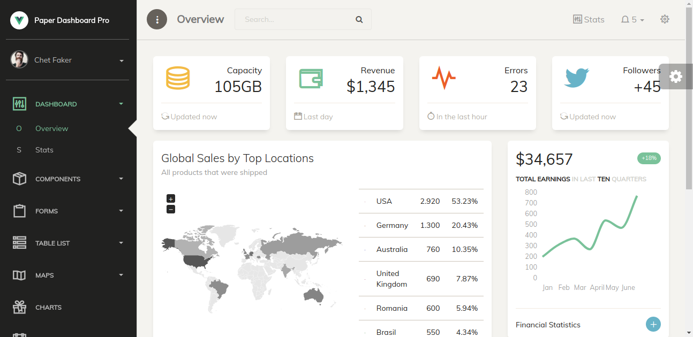
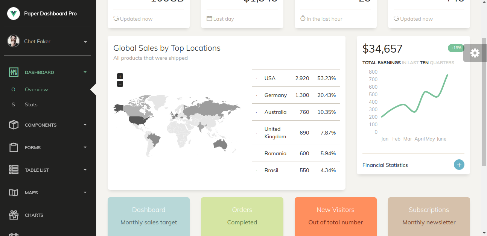
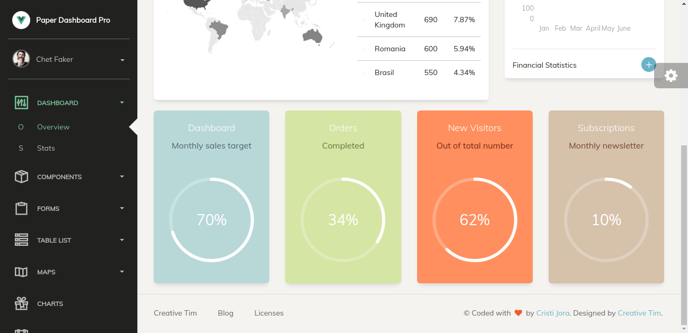

# Dashboard Template

## Expectation:

* View 1:



* View 2:



* View 3:



First Step:

```
git clone git@github.com:elibiz443/dashboard_template.git (paste it on gitbush)
```

Step 2:

```
cd dashboard_template (paste this to gitbush)
```

Step 3:

Go to 'index.html' And CSS files and start creating the views.

Voilà
